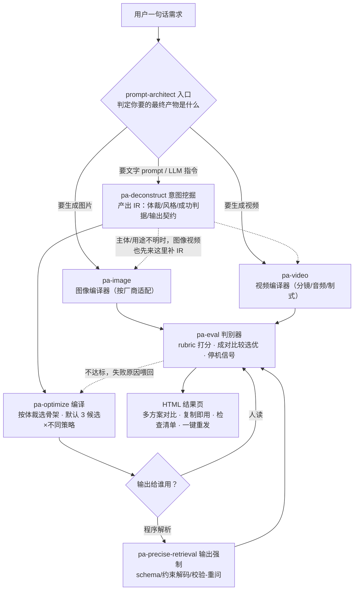

# prompt-architect · 提示词优化套件

> 一套 Claude Code skill：你说一句模糊的需求，它帮你挖出**真实意图**，按**体裁**编译成结构化 prompt（默认 3 个候选方案让 AI 评分择优），最后交付一个**可查看、可复制、可逐项检查**的 HTML 结果页。
> 覆盖**文字 prompt**（文案 / 对话机器人 / 抽取分类 / agent 指令）、**文生图 prompt**、**文生视频 prompt**。不会写代码也能用。

**核心理念**（蒸馏自 20 个 top prompt-engineering 框架的源码级分析）：
prompt 不是被写出来的散文，而是从「类型化 I/O 契约」编译出的产物——**人拥有意图，循环拥有措辞**。

---

## 目录

- [先看效果：三个真实测试实例](#先看效果三个真实测试实例)
- [新手须知：这是什么、解决什么问题](#新手须知这是什么解决什么问题)
- [安装（2 分钟）](#安装2-分钟)
- [怎么用](#怎么用)
- [工作原理](#工作原理)
- [六大体裁模板：为什么产出不千篇一律](#六大体裁模板为什么产出不千篇一律)
- [HTML 结果页里有什么](#html-结果页里有什么)
- [进阶：目录结构 / 回归测试 / 二次开发](#进阶目录结构--回归测试--二次开发)
- [FAQ](#faq)

---

## 先看效果：三个真实测试实例

同样一套工具，喂三种完全不同的需求，看它产出的 prompt **骨架是否千篇一律**——这是本套件最核心的卖点（反同质化）。三个实例的完整结果页都在 [`examples/`](examples/)，可下载后直接用浏览器打开。

| 测试输入（用户原话） | 判定体裁 | 候选数 | 胜出策略 | eval 得分 |
|---|---|---|---|---|
| "帮我写个小红书种草文案的 prompt，推我们家的氨基酸洗发水，要那种闺蜜安利的感觉" | creative（创意文案） | 3 | persona-driven | 0.87 ✅ |
| "给我们电商客服机器人写个 system prompt，要会安抚情绪，别乱承诺赔偿" | conversation_role（对话角色） | 3 | dialogue-scripted | 0.88 ✅ |
| "写个 prompt，从合同文本里抽出甲方、乙方、合同金额、签订日期、违约条款，给我们系统入库用" | extract（抽取，机器消费） | 1（刻意单候选） | contract-anchored | 0.93 ✅ |

三份胜出 prompt 的**骨架段落完全不同**：

```text
小红书（creative）   ：Brief → 人设 → Voice 声线卡 → 口吻校准 → 内容契约 → 形态轮廓
                      （没有规则清单、没有 JSON、没有 stop 标记——文案要的是声线，不是说明书）

客服机器人（对话角色）：Persona → 边界与权限 → 边界演练脚本（主体）→ 升级与移交 → 回复规约
                      （约束长成"场景→示范应答"的对话脚本，而不是字段定义）

合同抽取（extract）  ：Role → Goal → Rules → Workflow → Output Format(JSON-schema 逐字注入
                      + stop 标记) → Examples(含"信息缺失→null"示例) → Input
                      （机器要消费，所以约束拉到最紧，且只出 1 个候选——这里多样性没有价值）
```

### 结果页长这样（小红书实例，3 候选 grid 对比 · 点图可跳到可下载的 HTML 原件）

[](examples/result-xiaohongshu.html)

<details>
<summary>📸 展开看另外两个实例的结果页截图</summary>

**客服机器人 system prompt**（3 候选：persona-driven / dialogue-scripted / negative-first，边界演练脚本型胜出）：

[](examples/result-cs-bot.html)

**合同要素抽取**（单候选 + schema 强制 + 19 项检查清单，含输出强制层）：

[](examples/result-contract-extract.html)

</details>

> 实例中所有品牌名、优惠券额度等未提供的信息均以 `{{占位符}}` 模板化（套件铁律：**宁可留空位，绝不编造**）；做过的关键假设全部记录在结果页的「改了什么/为什么」区。

---

## 新手须知：这是什么、解决什么问题

**什么是 skill？** Claude Code（Anthropic 官方 CLI/桌面端）支持给 AI 装"技能包"——放在 `.claude/skills/` 目录下的一组说明书。装好后不需要任何代码，AI 会在合适的时机自动按说明书工作。本仓库就是 7 个这样的技能包。

**它解决三个常见痛点：**

1. **"我说不清我要什么"** —— 你只会说"帮我写个文案 prompt"，但好 prompt 需要知道给谁看、什么语气、多长、什么红线。套件的第一步就是**挖意图**：缺什么问什么（最多 3 个问题），把你的需求变成一份类型化的"意图档案"（IR）。
2. **"AI 写的 prompt 千篇一律"** —— 市面上的 prompt 优化工具，不管你要文案还是要抽取，都给你套同一副"角色+规则+步骤+输出格式"的骨架。本套件按**六大体裁**分骨架（见下文），文案有文案的长法，机器人有机器人的长法。
3. **"改完到底好没好，全凭感觉"** —— 套件内置**判别器**（pa-eval）：从你的成功判据编译评分标准，给每个候选打分、两两比较选优、不达标自动把失败原因喂回去重写。

---

## 安装（2 分钟）

前置条件：已安装 [Claude Code](https://claude.com/claude-code)（CLI、桌面端或 IDE 插件均可）。

```bash
git clone https://github.com/Cy4nLiang/prompt-architect.git

# 方式一（推荐）：装进某个项目，仅该项目可用
cd /path/to/your-project
/path/to/prompt-architect/install.sh --project

# 方式二：装到用户级，所有项目可用（在任意目录执行均可）
/path/to/prompt-architect/install.sh
```

装完**重开 Claude Code** 即生效。以后升级：`git pull` 后重跑一次 `install.sh`（脚本是同步语义，会覆盖到最新版）。

> ⚠️ 不要用 `cp` 手动复制 skill 目录——新旧版本混装是触发错乱的头号根源，一律走 `install.sh`。

---

## 怎么用

直接对 Claude **说人话**，不需要记命令。这些说法都会触发套件：

```text
帮我优化这个 prompt：（贴上你现有的 prompt）
从零帮我写个让 AI 生成周报的 prompt
这个 prompt 不好用，输出格式总错，帮我看看
写个生成商品白底图的提示词，用哪个模型好？
帮我写个产品广告视频的 prompt
```

接下来会发生什么：

1. **它先问你**（最多 3 个问题）：补齐目标、受众、红线等关键缺口——不会上来就闷头写；
2. **给你看它理解的意图**：你确认抓得对不对；
3. **产出 prompt + HTML 结果页**：终端里给你一条 `open …` 命令，浏览器打开就能复制、对比候选、逐项勾检查清单；
4. **不满意就说哪不对**：它会在原版基础上做最小修改，不会推倒重来（历次尝试有版本记录，改坏了会自动回退）。

> **给运营/非技术同事**：发给 TA [`docs/ops-onboarding.md`](docs/ops-onboarding.md)，照着填空就能用；结果页里的 prompt 复制后粘进 ChatGPT / 豆包 / Kimi / 即梦等任意工具均可。

---

## 工作原理

7 个 skill 组成一条流水线，**只有 `prompt-architect` 是入口**，其余都是它的内部工序（不要直接喊它们的名字）：



> 读图说明：入口分支上的"要生成图片/视频"指的是**你想要的最终产物**，不是要你先提供一张图——图像/视频有各自的专用编译器，所以最先判产物模态，能直达就不绕文字管线；只有当主体/用途说不清时，才先走一趟意图挖掘补全信息（虚线）。入口节点本身做三件事：把你的原话**围栏成数据**（防 prompt 注入）、复杂度筛查（太简单就直接内联改写）、按"模态→状态→消费者"三段路由。

| skill | 职责一句话 |
|---|---|
| **prompt-architect** | 唯一入口：把你的原话围栏成数据（防 prompt 注入）、判断复杂度、路由到对应工序 |
| pa-deconstruct | 医生问诊：挖出真实意图，落成类型化 IR（体裁、风格、成功判据、输出契约） |
| pa-optimize | 编译器：按体裁选骨架模板，默认 3 候选×正交策略，各绑一句改动假设 |
| pa-eval | 判别器：从成功判据编译评分标准；打分、两两比较、写停机信号——只打分，绝不执笔 |
| pa-precise-retrieval | 输出强制：当输出要喂程序时，把约束拉到最紧（schema/约束解码/校验-重问） |
| pa-image | 文生图编译器：主体/构图/光线/保真/排除项，按厂商适配 negative 与画幅写法 |
| pa-video | 文生视频编译器：时长预算/分镜/运镜/音频对白/跨镜头一致性，按厂商制式渲染 |

---

## 六大体裁模板：为什么产出不千篇一律

套件把文字 prompt 分成六个体裁，**每个体裁一副结构性不同的骨架**（不是同一骨架的松紧微调）。模板源文件在 [`skills/prompt-architect/reference/templates/`](skills/prompt-architect/reference/templates/)。

| 体裁 | 典型需求 | 骨架核心（与众不同之处） |
|---|---|---|
| creative | 小红书/广告/品牌故事 | **Voice 声线卡 + 示范文本**代替规则清单；没有 JSON、没有 stop 标记 |
| conversation_role | 客服/陪聊/角色扮演 | **Persona + 对话策略 + 边界演练脚本**；按"轮/场景"设计而非"字段" |
| extract | 抽取/分类/结构化 | 五段式 + **JSON-schema 逐字注入** + stop 标记 + "不确定→null" |
| analytical | 分析/评审/报告 | **分析框架（维度即契约）+ 证据三分类**（事实/推断/假设）+ 结论先行 |
| agent_system | 工具型 agent 指令 | **工具契约（何时不用）+ 决策循环 + 可判定的停止条件** + 安全红线 |
| rewrite_light | 改语气/压缩/翻译 | **≤10 行极简**：不变项 + 改动方向 + 1 个对照示例；禁止加戏 |

配套机制：

- **多候选**：非抽取体裁默认出 3 个候选，策略取自 [tip 库](skills/pa-optimize/reference/strategy-tips.md)（persona 驱动/极简/重示例/重流程/红线前置…），每个候选标注**代价**（tradeoff）——你看到的不是黑箱终稿，而是"押了哪三种结构、各牺牲了什么"；
- **刻意的单候选**：抽取类和轻改写不开多候选——约束空间窄，多候选只是伪多样性；
- **判别器兜底**：pa-eval 按体裁评分（文案查"声线合规+与示范差异度"，抽取查"字段精确率+null 正确性+schema 合规"），两两比较时交换位置跑两遍防偏置，质量打平时短者胜。

---

## HTML 结果页里有什么

每次优化的默认交付物（渲染器：[`render_result.py`](skills/prompt-architect/scripts/render_result.py)，零依赖纯 Python）：

1. **你的原始请求**——逐字保留，方便核对没被曲解；
2. **解构出的意图**——真实目的/成功判据/不做什么，先确认抓对了再看产出；
3. **候选方案 grid**（多候选时）——每卡标策略徽章、改动假设、⚖ 代价、评分，pa-eval 推荐者高亮；
4. **优化后的 prompt**——单条复制 + 批量复制，图像类带中英对照（英文喂 MJ/gpt-image，中文喂即梦）；
5. **质量检查清单**——按体裁只列适用项（不会拿"JSON 合规"为难一篇文案），可勾选；
6. **改了什么/为什么**——每处改动可追溯，含所有关键假设；
7. **不达标→一键重发**——把没勾上的检查项自动拼成"请针对这些点重做"的话术，复制回炉。

---

## 进阶：目录结构 / 回归测试 / 二次开发

```text
skills/                              ← skill 唯一源（改这里，然后跑 install.sh / sync）
├── prompt-architect/                ← 入口路由
│   ├── SKILL.md
│   ├── reference/
│   │   ├── ir-schema.md             ← IR：全套件共享的意图数据契约
│   │   ├── prompt-template.md       ← 体裁模板谱系索引 + general 兜底骨架
│   │   ├── templates/               ← 六大体裁模板（creative / conversation-role / extract / …）
│   │   ├── quality-checklist.md     ← 三层质检清单（L0 安全 / L1 结构 / L2 强制），按体裁条件适用
│   │   └── render-protocol.md       ← 结果 JSON → HTML 的渲染契约
│   └── scripts/render_result.py     ← HTML 结果页渲染器
├── pa-deconstruct/                  ← 意图挖掘（examples/ 含三体裁对照 IR 示例）
├── pa-optimize/                     ← 编译器（reference/strategy-tips.md 候选策略库）
├── pa-eval/                         ← 判别器（reference/rubric-templates.md 体裁评分模板）
├── pa-precise-retrieval/            ← 输出强制
├── pa-image/                        ← 文生图（reference/vendor-matrix.md 厂商矩阵）
└── pa-video/                        ← 文生视频（厂商矩阵 + 运镜词表 + 分镜 + 音频对白）

evals/trigger-cases.yaml             ← 12 条触发回归用例（改 skill description 前后各跑一遍）
examples/                            ← 本 README 三个测试实例的结果 JSON + HTML + 截图
scripts/sync-skills.sh               ← 开发用：skills/ 源 → 本仓库自身的 .claude/skills/
docs/ops-onboarding.md               ← 给运营/非技术同事的零代码上手指南（人读文档，不随 skill 安装）
docs/prompt-engineering-knowledge.html ← 理论知识库：20 框架的 8 范式/12 原则/12 设计模式
```

**改 skill 的规矩**：只改 `skills/` 下的源文件 → 跑 `scripts/sync-skills.sh`（本仓库内调试）或 `install.sh`（装到使用处）→ 对照 `evals/trigger-cases.yaml` 跑一遍触发回归（每条用例只凭 description 判断该触发谁，`must_not_trigger` 命中即失败）。

**想看实现一个实例的原料**：`examples/result-*.json` 就是渲染前的结果 JSON，对照 [`render-protocol.md`](skills/prompt-architect/reference/render-protocol.md) 能看懂每个字段怎么来的。

---

## FAQ

**Q：我直接说"用 pa-optimize 帮我改"行不行？**
不行也不必。pa-* 都是内部工序，绕过入口会跳过防注入围栏和意图挖掘——这正是产出同质化、被注入带偏的根源。直接说需求即可，路由是自动的。

**Q：结果里的 `{{占位符}}` 是什么？**
你没提供的信息（品牌名、优惠额度等），套件不编造，留成可替换槽位。用之前把它们替换成真实值——这也让同一个 prompt 可以复用于一系列同类任务。

**Q：我不用 Claude Code，这些 prompt 还有用吗？**
有用。结果页里的 prompt 是纯文本，粘到任何 LLM（ChatGPT/Kimi/豆包/即梦…）都能用；只是"自动挖意图、多候选、评分"这套流水线需要 Claude Code 来跑。

**Q：图像/视频 prompt 为什么要选厂商？**
因为各家写法不通约：negative prompt 有的厂商有独立入口、有的必须写进正文；视频厂商连骨架都不同（标签式 vs 散文式）。套件内置厂商矩阵，会按你的诉求推荐 2 家并按其语法编译。

**Q：评分是真的在评吗？**
是按你的成功判据 + 体裁规则编译出的评分标准打的分（理由先行，防"先给分再找理由"），两两比较还会交换位置跑两遍防顺序偏置。但它仍是 LLM 判分——把它当强信号，别当真值。

---

## 理论来源

套件规则蒸馏自对 20 个 top prompt-engineering 框架（DSPy、guidance、outlines、instructor、LangGPT、BAML、guardrails、TextGrad、promptfoo、Prompty、LMQL、ell、mirascope、promptbase、12-factor-agents…）的源码级分析，完整知识库见 [`docs/prompt-engineering-knowledge.html`](docs/prompt-engineering-knowledge.html)（GitHub 上点开是源码，**下载后用浏览器打开**即可阅读）。

MIT License · 欢迎 issue / PR。

*README 中的三个测试实例均由该套件自身的流水线产出——吃自己的狗粮。*
